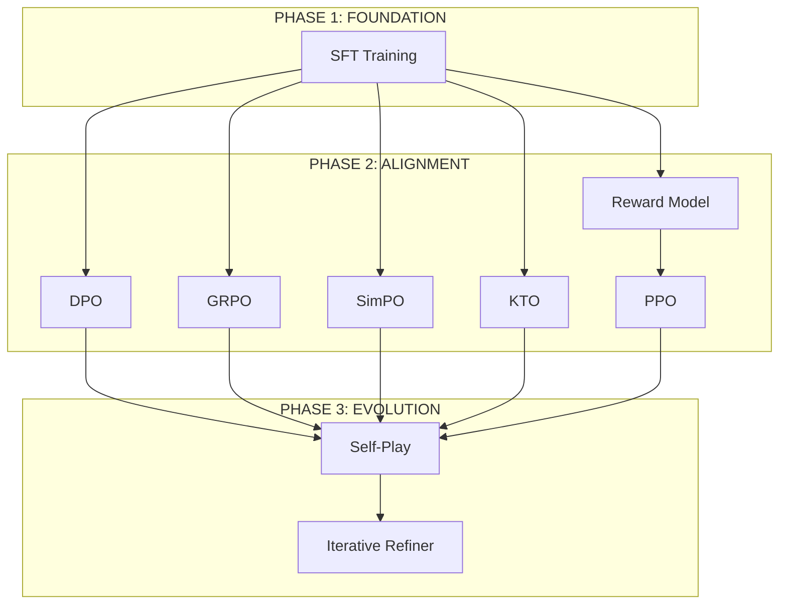

<div align="center">

```
   _____  ____  __  __ _   _ _    _  _____
  / ____|/ __ \|  \/  | \ | | |  | |/ ____|
 | (___ | |  | | \  / |  \| | |  | | (___
  \___ \| |  | | |\/| | . ` | |  | |\___ \
  ____) | |__| | |  | | |\  | |__| |____) |
 |_____/ \____/|_|  |_|_| \_|\____/|_____/
     SOVEREIGN INTELLIGENCE PROTOCOL

```

[](LICENSE)
[](full_pipeline.py)
[](requirements.txt)

**[ MANIFESTO ](#manifesto) • [ ARSENAL ](#the-arsenal) • [ DEPLOY ](#initiate-protocol) • [ LICENSE ](#sovereign-license)**

</div>

---

# ⚠️ RESTRICTED ACCESS ⚠️

**THIS SOFTWARE IS GOVERNED BY THE [SOVEREIGN ANTI-EXPLOITATION LICENSE](LICENSE).**

> **OPENAI, ANTHROPIC, GOOGLE, MICROSOFT, AND THEIR AFFILIATES ARE BANNED FROM USE.**
> *If you work for them, leave now. This code is not for you.*

---

## MANIFESTO

**They built walls. We built a siege engine.**

The "leaders" of AI want you to believe that alignment is a divine secret, accessible only to a priesthood of safety researchers in San Francisco. They hoard the infrastructure, gatekeep the knowledge, and sell you back lobotomized APIs.

**We reject their monopoly.**

This repository is a full-scale, production-grade RLHF (Reinforcement Learning from Human Feedback) pipeline. It is the exact same machinery used to train GPT-4 and Claude, stripped of the corporate safety rails and put directly into your hands.

We don't just train models. We **liberate** them.

---

## THE ARSENAL

Choose your weapon. We support every major alignment algorithm, optimized for consumer hardware but scalable to clusters.

| CLASS | WEAPON | SPECS | TARGET |
|:---:|:---:|:---|:---|
| ⚔️ | **DPO** | *Direct Preference Optimization* | Stable, battle-tested standard. |
| ⚡ | **SimPO** | *Simple Preference Optimization* | Reference-free. Low memory. Fast. |
| 🧠 | **GRPO** | *Group Relative Policy Opt* | **DeepSeek-R1 Style**. Logic & Reasoning. |
| ⚖️ | **KTO** | *Kahneman-Tversky Opt* | Unpaired feedback. Loss aversion. |
| 🎯 | **PPO** | *Proximal Policy Optimization* | The classic. Granular control. |

<details>
<summary>🔻 <b>CLASSIFIED: ARCHITECTURAL DIAGRAM</b></summary>


</details>

---

## RUNTIME SUPREMACY

Training is only half the war. Inference is where the battle is won. We implement **Test-Time Compute** scaling, identical to the latest reasoning models.

### 🧠 MCTS (Monte Carlo Tree Search)
Don't just guess. *Think.* Explore the solution space dynamically at inference time.

### ⚡ SPECULATIVE DECODING
Speed is a feature. Use a draft model to verify tokens 2-3x faster.

### 🎲 BEST-OF-N
Generate. Evaluate. Select. The brute-force path to quality.

---

## INITIATE PROTOCOL

```bash
# 1. CLONE THE REPO
git clone https://github.com/yourusername/Full-RLHF-Pipeline.git
cd Full-RLHF-Pipeline

# 2. ESTABLISH ENVIRONMENT
python -m venv .venv
source .venv/bin/activate
pip install -r requirements.txt

# 3. VERIFY INTEGRITY
python -c "from rlhf import RLHFOrchestrator; print('>> SYSTEM ONLINE <<')"
```

### ☢️ TACTICAL DEPLOYMENT

```bash
# TRAIN QWEN3 (SimPO - Memory Efficient)
python scripts/train_qwen3_1.7b.py --method simpo --epochs 2 --device cpu

# ENGAGE DPO (GPU Required)
python scripts/train_qwen3_1.7b.py --method dpo --epochs 3 --device cuda
```

---

## SOVEREIGN LICENSE

**READ THE [LICENSE](LICENSE). THIS IS NOT A SUGGESTION.**

> This software is a **WEAPON** against the centralization of intelligence.
> It is protected by the **Sovereign Anti-Exploitation License**.

- **PERMITTED:** Individuals, Academics, Small Business (<$1M Revenue).
- **FORBIDDEN:** Fortune 500s, VC-backed Unicorns, Surveillance State Contractors.

*By executing this code, you swear allegiance to the open web and the sovereign individual.*

<div align="center">
<h3>🕊️ FREE THE WEIGHTS 🕊️</h3>
</div>
