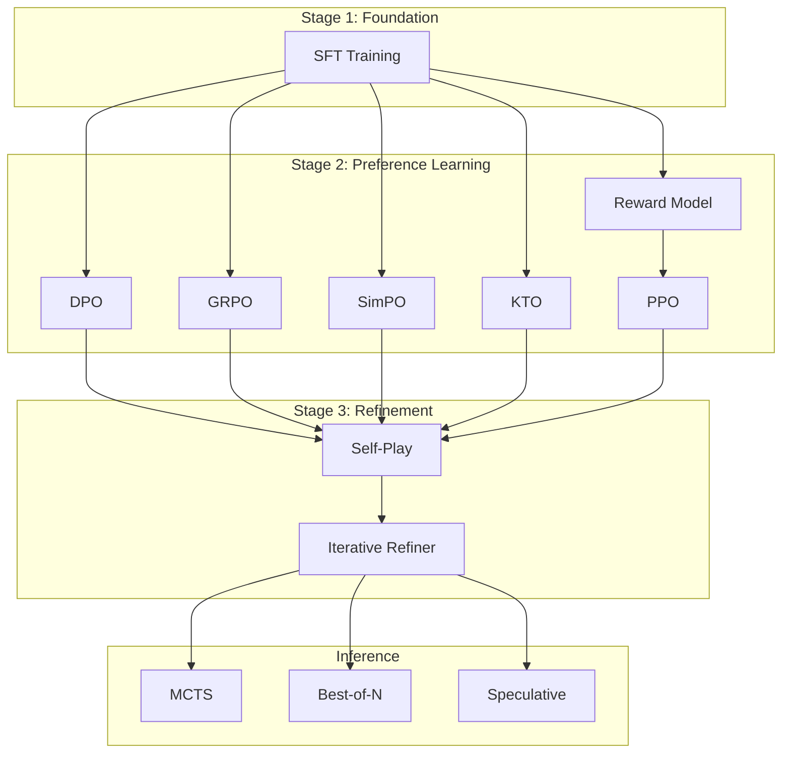

<div align="center">

# Full-RLHF-Pipeline

### Complete Open-Source RLHF Implementation


<br/>

[**Quick Start**](#quick-start) • [**Methods**](#rlhf-methods) • [**Features**](#features) • [**Architecture**](#architecture) • [**Benchmarks**](#method-comparison)

<br/>
</div>

---

## Overview

This repository provides a production-grade implementation of the Reinforcement Learning from Human Feedback (RLHF) pipeline. It mirrors the post-training infrastructure used by major research labs, optimized for consumer hardware.

The codebase includes implementations of 7 distinct preference optimization algorithms (including PPO, DPO, SimPO, and DeepSeek's GRPO) alongside advanced inference techniques such as Monte Carlo Tree Search (MCTS) and Speculative Decoding. It is designed for researchers and developers who require full control over the alignment process without the constraints of commercial APIs or safety-filtered datasets.

---

## Mission

The exclusive control over post-training infrastructure has allowed a few organizations to artificially monopolize AI capabilities. They claim innovation while simply gating access to standard reinforcement learning techniques. THIS REPOSITORY IS GOVERNED BY THE Sovereign Anti-Exploitation Software License

This repository dismantles that barrier. By open-sourcing the complete, unencumbered RLHF pipeline used by industry leaders, we aim to undercut the artificial scarcity of high-quality models. The goal is simple: put the reproduction of state-of-the-art capabilities directly into the hands of the open-source community, removing the reliance on closed-source APIs for model alignment.

---

## Quick Start

```bash
# Clone and setup
git clone https://github.com/yourusername/Full-RLHF-Pipeline.git
cd Full-RLHF-Pipeline

# Create environment
python -m venv .venv
source .venv/bin/activate  # Windows: .venv\Scripts\activate
pip install -r requirements.txt

# Verify installation
python -c "from rlhf import RLHFOrchestrator; print('Environment configured.')"
```

### Training Example

```bash
# Train Qwen3 1.7B with SimPO (Memory efficient, reference-free)
python scripts/train_qwen3_1.7b.py --method simpo --epochs 2 --device cpu

# Train with DPO on GPU
python scripts/train_qwen3_1.7b.py --method dpo --epochs 3 --device cuda
```

---

## RLHF Methods

### Direct Optimization

*Gradient-based preference learning without explicit reward modeling*

| Method | Paper | Description |
|:---:|:---:|:---|
| **DPO** | [Rafailov et al. (2023)](https://arxiv.org/abs/2305.18290) | Direct Preference Optimization. Stable and widely adopted. |
| **SimPO** | [Meng et al. (2024)](https://arxiv.org/abs/2405.14734) | Simple Preference Optimization. Reference-free, memory efficient. |
| **KTO** | [Ethayarajh et al. (2024)](https://arxiv.org/abs/2402.01306) | Kahneman-Tversky Optimization. Uses unpaired binary feedback. |
| **IPO** | [Azar et al. (2023)](https://arxiv.org/abs/2310.12036) | Identity Preference Optimization. Provides theoretical guarantees. |

### Reinforcement Learning

*Policy optimization against a reward signal*

| Method | Paper | Description |
|:---:|:---:|:---|
| **PPO** | [Schulman et al. (2017)](https://arxiv.org/abs/1707.06347) | Proximal Policy Optimization. Standard for granular control. |
| **GRPO** | [DeepSeek-R1 (2024)](https://arxiv.org/abs/2401.14196) | Group Relative Policy Optimization. Used for reasoning tasks. |
| **Self-Play** | - | Iterative generation and refinement against a reward function. |

---

## Features

| Component | Capabilities |
|:---|:---|
| **Optimization Algorithms** | PPO, DPO, GRPO, SimPO, KTO, IPO, Self-Play |
| **Inference Engine** | Flash Attention 2, Speculative Decoding, MCTS, Best-of-N Sampling |
| **Training Efficiency** | LoRA/QLoRA (4-bit/8-bit), Gradient Checkpointing, Torch Compile |
| **Model Merging** | TIES-Merging, SLERP, Task Arithmetic, Model Soups |

### Inference Logic

The repository includes implementations of test-time compute scaling methods similar to those described in recent reasoning literature (e.g., O1, DeepSeek-R1).

```python
from inference_optimizations import MCTSGenerator, BestOfNSampler

# Best-of-N Sampling
sampler = BestOfNSampler(policy_model, reward_model)
result = sampler.generate(prompt, n_samples=16)

# Monte Carlo Tree Search
mcts = MCTSGenerator(policy_model, value_model, tokenizer)
result = mcts.generate(prompt, max_length=512)
```

---

## Architecture



---

## Method Selection Guide

| Method | Reference Model | Memory Usage | Implementation Stability | Optimal Use Case |
|:---:|:---:|:---:|:---:|:---|
| **DPO** | Required | Medium | High | General purpose preference alignment |
| **SimPO** | Not Required | Low | High | Memory-constrained environments |
| **GRPO** | Not Required | Medium | Medium | Mathematical reasoning & code generation |
| **KTO** | Required | Medium | High | Datasets with unpaired feedback |
| **PPO** | Required | High | Low | Complex reward functions & online learning |

---

## Implementation Notes

* **No Safety Filtering**: This pipeline applies no inherent safety filtering or aligned rejection sampling. The model's behavior is determined solely by the data provided.
* **Modular Design**: All components (Trainers, models, strategies) are decoupled to allow for custom implementations.
* **Production Ready**: Code is structured for maintainability and scalability, handling logging, checkpointing, and error recovery robustly.

---

## References

**Direct Preference Optimization**
Rafailov, R., et al. (2023). Direct Preference Optimization: Your Language Model is Secretly a Reward Model.

**SimPO**
Meng, Y., et al. (2024). SimPO: Simple Preference Optimization with a Reference-Free Reward.

**DeepSeek-R1**
DeepSeek-AI. (2024). DeepSeek-R1: Incentivizing Reasoning Capability in LLMs via Reinforcement Learning.

**Proximal Policy Optimization**
Schulman, J., et al. (2017). Proximal Policy Optimization Algorithms.

**FlashAttention-2**
Dao, T. (2023). FlashAttention-2: Faster Attention with Better Parallelism and Work Partitioning.
