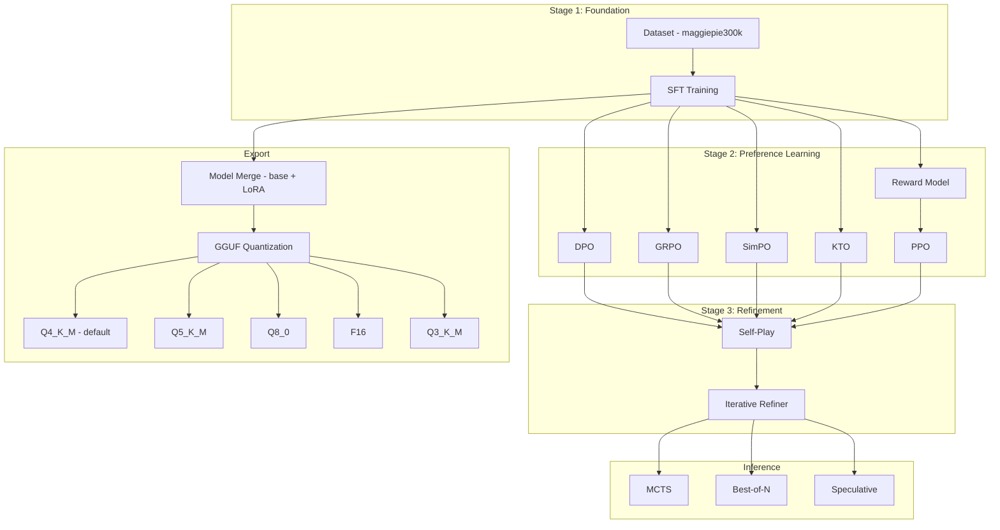

<div align="center">

# Full-RLHF-Pipeline

### Complete Open-Source RLHF Implementation


[](https://www.gnu.org/licenses/gpl-3.0)

[](https://doi.org/10.5281/zenodo.18607464)


<br/>

[**Quick Start**](#quick-start) • [**Methods**](#rlhf-methods) • [**Features**](#features) • [**Architecture**](#architecture) • [**Research Lineage**](#research-lineage) • [**Validated Run**](#validated-training-run) • [**GGUF Releases**](#gguf-releases)

<br/>
</div>

---

## Overview

This public GPLv3 repository provides a production-grade implementation of the Reinforcement Learning from Human Feedback (RLHF) pipeline together with its companion inference and systems modules. It mirrors the post-training infrastructure used by major research labs, optimized for consumer hardware, including **CPU-only environments with zero GPU requirement**.

The codebase includes implementations of 7 distinct preference optimization algorithms alongside process reward modeling, verifier-guided search, and advanced inference techniques such as Monte Carlo Tree Search (MCTS), A* decoding, Best-of-N reranking, speculative decoding, and hidden-deliberation serving contracts. It is designed for researchers and developers who want full control over post-training and test-time compute behavior without relying on commercial APIs or opaque hosted tooling.

As of March 2026, this pipeline has produced publicly released GGUF-quantized models trained entirely on consumer CPU hardware, demonstrating end-to-end viability from raw dataset to deployable artifact.

---

## Mission

The exclusive control over post-training infrastructure has allowed a few organizations to artificially monopolize AI capabilities. They claim innovation while simply gating access to reinforcement learning, reward modeling, verifier-guided search, and test-time compute techniques. This repository is released under **GPLv3** so the stack can be studied, modified, reproduced, and extended in the open.

This repository dismantles that barrier. By open-sourcing a complete RLHF runtime plus its surrounding inference, search, telemetry, and merge/export surfaces, the goal is to put reproduction of high-end post-training capability directly into the hands of the open-source community and reduce reliance on closed-source alignment and reasoning stacks.

---

## Quick Start

```bash
# Clone and setup
git clone https://github.com/calisweetleaf/Reinforcement-Learning-Full-Pipeline.git
cd Full-RLHF-Pipeline

# Create environment
python -m venv .venv
source .venv/bin/activate  # Windows: .venv\Scripts\activate
pip install -r requirements.txt

# Verify installation
python -c "from rlhf import RLHFOrchestrator; print('Environment configured.')"
```

### Training Example

```bash
# Train Qwen3 1.7B with SimPO (Memory efficient, reference-free)
python scripts/train_qwen3_1.7b.py --method simpo --epochs 2 --device cpu

# Train with DPO on GPU
python scripts/train_qwen3_1.7b.py --method dpo --epochs 3 --device cuda
```

---

## RLHF Methods

### Direct Optimization

*Gradient-based preference learning without explicit reward modeling*

| Method | Paper | Description |
|:---:|:---:|:---|
| **DPO** | [Rafailov et al. (2023)](https://arxiv.org/abs/2305.18290) | Direct Preference Optimization. Stable and widely adopted. |
| **SimPO** | [Meng et al. (2024)](https://arxiv.org/abs/2405.14734) | Simple Preference Optimization. Reference-free, memory efficient. |
| **KTO** | [Ethayarajh et al. (2024)](https://arxiv.org/abs/2402.01306) | Kahneman-Tversky Optimization. Uses unpaired binary feedback. |
| **IPO** | [Azar et al. (2023)](https://arxiv.org/abs/2310.12036) | Identity Preference Optimization. Provides theoretical guarantees. |

### Reinforcement Learning

*Policy optimization against a reward signal*

| Method | Paper | Description |
|:---:|:---:|:---|
| **PPO** | [Schulman et al. (2017)](https://arxiv.org/abs/1707.06347) | Proximal Policy Optimization. Standard for granular control. |
| **GRPO** | [DeepSeek-R1 (2024)](https://arxiv.org/abs/2401.14196) | Group Relative Policy Optimization. Used for reasoning tasks. |
| **Self-Play** | - | Iterative generation and refinement against a reward function. |

---

## Features

| Component | Capabilities |
|:---|:---|
| **Optimization Algorithms** | PPO, DPO, GRPO, SimPO, KTO, IPO, Self-Play |
| **Inference Engine** | Flash Attention 2, Speculative Decoding, MCTS, A* Search, Best-of-N Sampling, hidden-deliberation serving |
| **Training Efficiency** | LoRA/QLoRA (4-bit/8-bit), Gradient Checkpointing, Torch Compile |
| **Model Merging** | TIES-Merging, SLERP, Task Arithmetic, DARE, Fisher-Weighted, RegMean, Geometric Mean, Sign Consensus, Model Soups |
| **GGUF Export** | Post-merge quantization pipeline: F16, Q8_0, Q5_K_M, Q4_K_M (default), Q3_K_M and additional variants |
| **Telemetry** | Thread-safe metrics sink — latency histograms (p50/p95/p99), token throughput, KV-cache hit/miss, MCTS expansion counters, speculative acceptance rates, TensorBoard adapter, JSON snapshot emit |
| **Benchmark Harness** | Standardized eval matrix for merge strategies and inference presets, budget-aware profile selector (tiny_cpu / balanced_cpu / gpu_lowlatency / gpu_maxquality), regression gate for CI promotion gating |
| **Inference Protocols** | Protocol-based adapter layer decoupling `PolicyAdapter`, `RewardScorerAdapter`, `ValueScorerAdapter` from ad-hoc model attributes — no assumed `.device` or `.score_text` |
| **Process Supervision** | `ProcessRewardModel`, `ProcessRewardModelTrainer`, and PRM-aware reranking / reward blending for step-sensitive reasoning workflows |
| **CPU-Only Support** | Full SFT training, LoRA adapter training, and model merging validated on CPU hardware with no GPU dependency |

### Inference Logic

The repository includes an experimental inference and test-time-compute stack grounded in public work on process supervision, verifier-guided search, hidden deliberation, and reasoning-oriented reinforcement learning. The exposed runtime primitives include PRM-aware reranking, MCTS, A* search, hidden-deliberation serving, and search-oriented runtime helpers.

```python
from inference_optimizations import MCTSGenerator, BestOfNSampler

# Best-of-N Sampling
sampler = BestOfNSampler(policy_model, reward_model)
result = sampler.generate(prompt, n_samples=16)

# Monte Carlo Tree Search
mcts = MCTSGenerator(policy_model, value_model, tokenizer)
result = mcts.generate(prompt, max_length=512)
```

---
## Architecture


```mermaid
graph TB
    subgraph "Stage 1: Foundation"
        SFT[SFT Training]
        DATA[Dataset - maggiepie300k]
    end
    
    subgraph "Stage 2: Preference Learning"
        RM[Reward Model]
        DPO[DPO]
        GRPO[GRPO]
        SimPO[SimPO]
        KTO[KTO]
        PPO[PPO]
    end
    
    subgraph "Stage 3: Refinement"
        SP[Self-Play]
        IR[Iterative Refiner]
    end
    
    subgraph "Inference"
        MCTS[MCTS]
        BoN[Best-of-N]
        SD[Speculative]
    end

    subgraph "Export"
        MERGE[Model Merge - base + LoRA]
        GGUF[GGUF Quantization]
        Q4[Q4_K_M - default]
        Q5[Q5_K_M]
        Q8[Q8_0]
        F16[F16]
        Q3[Q3_K_M]
    end
    
    DATA --> SFT
    SFT --> RM
    SFT --> DPO
    SFT --> GRPO
    SFT --> SimPO
    SFT --> KTO
    RM --> PPO
    
    SFT --> MERGE
    MERGE --> GGUF
    GGUF --> Q4
    GGUF --> Q5
    GGUF --> Q8
    GGUF --> F16
    GGUF --> Q3
    
    DPO --> SP
    GRPO --> SP
    SimPO --> SP
    KTO --> SP
    PPO --> SP
    
SP --> IR
IR --> MCTS
IR --> BoN
IR --> SD
```

---

## Repo Surfaces

These files are part of the current public repo surface and are kept in-repo because they document the runtime and implementation context around the core training stack.

| File | Current role |
|:---|:---|
| `INFERENCE_ARCHITECTURE_ANALYSIS.md` | Architecture-facing analysis of the inference lane and its intended integration posture |
| `RLHF_CODEBASE_MAPPING_PLAN-1.md` | File-topology and authority map for the current codebase |
| `NOTEPAD.md` | Working continuity and operator note surface preserved in-repo for live alignment work |

The public landing page prioritizes the canonical runtime docs and direct literature lineage over internal synthesis notes.

---

## Research Lineage

This experimental inference/search update is positioned as a synthesis of public literature and implementation work, not as a claim around any proprietary system label. The most relevant paper line for the current public runtime surface includes:

- `Let's Verify Step by Step`
- `Let's Reinforce Step by Step`
- `Quiet-STaR: Language Models Can Teach Themselves to Think Before Speaking`
- `Fast Quiet-STaR: Thinking Without Thought Tokens`
- `AlphaZero-Like Tree-Search can Guide Large Language Model Decoding and Training`
- `StepSearch: Igniting LLMs Search Ability via Step-Wise Proximal Policy Optimization`
- `DeepSeek-R1: Incentivizing Reasoning Capability in LLMs via Reinforcement Learning`

---

## Method Selection Guide

| Method | Reference Model | Memory Usage | Implementation Stability | Optimal Use Case |
|:---:|:---:|:---:|:---:|:---|
| **DPO** | Required | Medium | High | General purpose preference alignment |
| **SimPO** | Not Required | Low | High | Memory-constrained environments |
| **GRPO** | Not Required | Medium | Medium | Mathematical reasoning & code generation |
| **KTO** | Required | Medium | High | Datasets with unpaired feedback |
| **PPO** | Required | High | Low | Complex reward functions & online learning |

---

## Validated Training Run

On **March 7, 2026**, this pipeline completed its first full end-to-end training and release run. All training was performed on **CPU only — no GPU hardware was used at any stage.**

| Property | Value |
|:---|:---|
| **Date** | March 7, 2026 |
| **Base Model** | Qwen3 1.7B |
| **Dataset** | maggiepie300k |
| **Hardware** | CPU only (no GPU) |
| **Training Stage** | SFT (Supervised Fine-Tuning) with LoRA |
| **Adapter Format** | `adapter_model.safetensors` + `adapter_config.json` |
| **Post-Training** | Base weights merged with SFT LoRA adapter via `ModelMerger` (Task Arithmetic) |
| **Release Stage** | Pre-DPO — SFT + merge validated, DPO stage upcoming |
| **Artifacts Released** | 5 GGUF quantizations |

This run validates the core claim of this repository: **a complete post-training pipeline is reproducible on consumer hardware without GPU access.** The SFT adapter was trained against the `maggiepie300k` dataset using the `scripts/train_qwen3_1.7b.py` entry point and merged with the Qwen3 1.7B base weights using `model_merging.py`'s deterministic SHA256-manifest artifact save. The merged model was then quantized to GGUF format across multiple bit-depths for broad deployment compatibility.

---

## GGUF Releases

Five GGUF quantizations of the merged Qwen3 1.7B SFT model are available. These represent the post-SFT, post-merge state of the model — before any DPO or further preference optimization stage.

| Quant | Description | Recommended Use |
|:---:|:---|:---|
| **Q4_K_M** | 4-bit K-quant, medium — **default release** | Best balance of size and quality for general deployment |
| **Q5_K_M** | 5-bit K-quant, medium | Higher fidelity; recommended when memory allows |
| **Q8_0** | 8-bit quantization | Near-lossless; for quality-critical inference |
| **F16** | Full 16-bit floating point | Reference quality; largest artifact |
| **Q3_K_M** | 3-bit K-quant, medium | Minimum memory footprint; edge/embedded deployment |

The Q4_K_M format is the recommended default for most users. It provides the best trade-off between inference speed, memory usage, and output quality at the 1.7B parameter scale.

```bash
# Load a GGUF quant with llama.cpp or any compatible runtime
./llama-cli -m qwen3-1.7b-sft-merged.Q4_K_M.gguf -p "Your prompt here" -n 256
```

---

## Model Merging

The `model_merging.py` module provides a full suite of stateless, deterministic merge algorithms. All methods operate in float32 internally and cast back to the original parameter dtype to prevent silent precision loss with bfloat16/float16 checkpoints.

```python
from model_merging import ModelMerger, MergeConfig, save_merge_artifact

config = MergeConfig(method="task_arithmetic", density=0.8, scaling_coef=1.0)
merger = ModelMerger(config)

merged = merger.merge(base_model, [sft_adapter_model])

# Deterministic SHA256 manifest — provenance tracking for every artifact
save_merge_artifact(
    merged,
    output_dir="./merged_output",
    metadata={"run_date": "2026-03-07", "dataset": "maggiepie300k"},
    merge_config=config,
)
```

| Algorithm | Key Property |
|:---|:---|
| **Task Arithmetic** | Linear delta scaling; fastest and most predictable |
| **TIES-Merging** | Trim low-magnitude deltas, elect sign consensus, merge |
| **DARE** | Drop and rescale; stochastic sparsification with seed control |
| **SLERP** | Spherical linear interpolation for smooth two-model blending |
| **Fisher-Weighted** | Fisher information weighting for importance-aware merging |
| **RegMean** | Gram matrix regularized mean for distribution-preserving merges |
| **Geometric Mean** | Karcher mean in parameter space; theoretically grounded |
| **Sign Consensus** | Majority-vote sign election across task vectors |
| **Model Soups** | Uniform or greedy weighted averaging across checkpoint ensembles |

---

## Benchmark Harness

The `benchmark_harness.py` module wraps the full inference and merge stacks in a standardized evaluation matrix, a budget-aware profile selector, and a regression gate for CI workflows.

```python
from benchmark_harness import BenchmarkHarness, BudgetProfileSelector, RegressionGate

# Profile selection based on hardware constraints
selector = BudgetProfileSelector()
merge_cfg, bon_cfg, mcts_cfg, spec_cfg = selector.select({
    "max_ram_gb": 8,
    "has_gpu": False,
    "latency_budget_ms": 500,
    "quality_priority": True,
})

# Run merge benchmark across all strategies
harness = BenchmarkHarness()
results = harness.run_merge_benchmark(base, [ft_model], strategies=["ties", "dare", "task_arithmetic"])
ranked = harness.rank_strategies(results)
harness.emit_report(results, "bench.json")

# Regression gate for CI promotion
gate = RegressionGate(thresholds={"quality_floor": 0.7, "latency_ceiling_ms": 800, "ram_ceiling_gb": 12})
ok = gate.check(current_results, baseline_results)
```

Available hardware profiles:

| Profile | Target Hardware | Merge Method | BoN Samples | MCTS Sims |
|:---:|:---|:---:|:---:|:---:|
| `tiny_cpu` | CPU, low RAM | task_arithmetic | 4 | 20 |
| `balanced_cpu` | CPU, moderate RAM | ties | 8 | 50 |
| `gpu_lowlatency` | GPU, latency-sensitive | dare | 8 | 50 |
| `gpu_maxquality` | GPU, quality-first | ties | 16 | 100 |

---

## Implementation Notes

* **No Safety Filtering**: This pipeline applies no inherent safety filtering or aligned rejection sampling. The model's behavior is determined solely by the data provided.
* **Modular Design**: All components (Trainers, models, strategies) are decoupled to allow for custom implementations.
* **Production Ready**: Code is structured for maintainability and scalability, handling logging, checkpointing, and error recovery robustly.
* **CPU-Only Viable**: The SFT training loop, LoRA adapter training, model merging, and telemetry collection are all validated on CPU hardware. GPU is supported and recommended for larger models and longer runs, but is not required.
* **Inference Protocol Layer**: `inference_protocols.py` provides `PolicyAdapter`, `RewardScorerAdapter`, and `ValueScorerAdapter` wrappers that satisfy typed Protocols without assuming specific model attributes. All inference components consume these adapters rather than raw model objects, enabling drop-in swaps of any compatible model.
* **Process-Supervision And Search**: The companion inference lane includes process-reward-aware reranking, verifier-guided search utilities, lexical-MDP abstractions, and hidden-deliberation answer-serving primitives for experimental test-time compute workflows.
* **Telemetry**: `telemetry.py` provides a `TelemetryRecorder` singleton with thread-safe reservoir sampling (Vitter's Algorithm R) for latency quantiles, speculative acceptance rates, KV-cache hit ratios, and MCTS expansion counts. Snapshots are emittable as JSON at any point in a run.
* **Deterministic Artifact Provenance**: All merge artifacts include a SHA256 manifest of input and output state dicts, recorded via `save_merge_artifact()`. This enables exact reproduction and audit of any released checkpoint.

---

## Provenance and Citation

If you use any methods, code, or repository in your research, please cite it and follow the current GPLv3 distribution terms used by this public repo.

```bibtex
@misc{https://doi.org/10.5281/zenodo.18607464, doi = {10.5281/ZENODO.18607464}, url = {https://zenodo.org/doi/10.5281/zenodo.18607464}, author = {Rowell, Christian Trey Levi}, keywords = {RLHF, DPO, PPO, Reinforcement Learning}, title = {Reinforcement Learning Multi Method Pipeline and Inference tooling}, publisher = {Zenodo}, year = {2026}, copyright = {GNU General Public License v3.0}}
```

--

## References

**Process Supervision**
Let's Verify Step by Step. (2023).

Let's Reinforce Step by Step. (2023).

**Hidden Deliberation**
Quiet-STaR: Language Models Can Teach Themselves to Think Before Speaking. (2024).

Fast Quiet-STaR: Thinking Without Thought Tokens. (2025).

**Search And Reasoning**
AlphaZero-Like Tree-Search can Guide Large Language Model Decoding and Training. (2023).

StepSearch: Igniting LLMs Search Ability via Step-Wise Proximal Policy Optimization. (2025).

A Training Data Recipe to Accelerate A* Search with Large Language Models. (2024).

**Direct Preference Optimization**
Rafailov, R., et al. (2023). Direct Preference Optimization: Your Language Model is Secretly a Reward Model.

**SimPO**
Meng, Y., et al. (2024). SimPO: Simple Preference Optimization with a Reference-Free Reward.

**DeepSeek-R1**
DeepSeek-AI. (2024). DeepSeek-R1: Incentivizing Reasoning Capability in LLMs via Reinforcement Learning.

**Proximal Policy Optimization**
Schulman, J., et al. (2017). Proximal Policy Optimization Algorithms.

**FlashAttention-2**
Dao, T. (2023). FlashAttention-2: Faster Attention with Better Parallelism and Work Partitioning.

