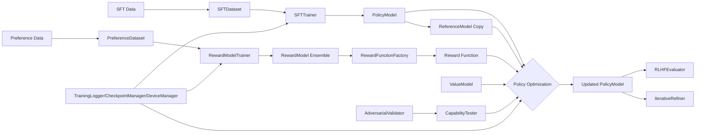
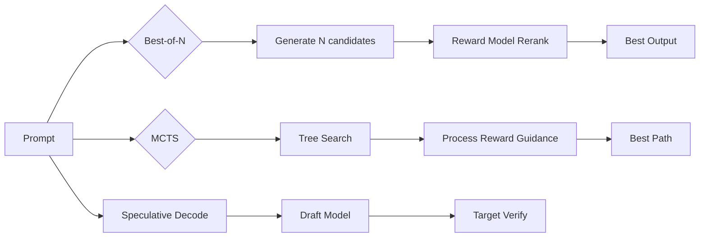
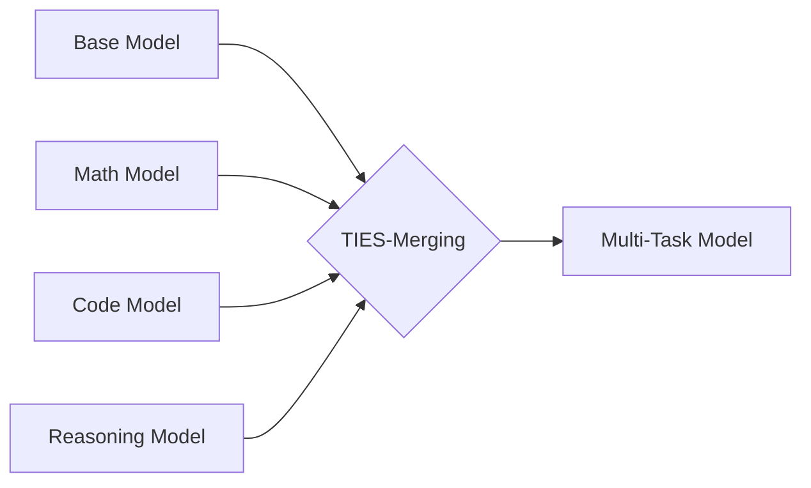

# RLHF Pipeline Specification (rlhf.py)

## Scope

This document specifies the end-to-end RLHF pipeline implemented in `rlhf.py`,
including data contracts, training stages, supporting infrastructure, and
self-improvement components. It reflects the current architecture and runtime
behavior in the codebase.

## Source Of Truth

- Core Implementation: `rlhf.py` (7334 lines, main RLHF methods)
- Inference Optimizations: `inference_optimizations.py` (Flash Attn, MCTS, Best-of-N)
- Model Merging: `model_merging.py` (TIES-Merging, Model Soups)
- Primary orchestrator: `RLHFOrchestrator`

## High-Level Architecture

### Training Pipeline

### Inference-Time Compute (SOTA++)

### Model Merging

## Core Concepts And Data Contracts

### Data Formats

- SFT samples: `{"prompt": str, "response": str}`
- Preference pairs: `{"prompt": str, "chosen": str, "rejected": str}`
- GRPO/PPO prompt-only: list of prompts or list of `{"prompt": str}`
- Unpaired KTO data: `{"prompt": str, "response": str, "label": "desirable"/"undesirable"}`
- MCTS/Reasoning: `{"prompt": str, "answer": str, "verifiable": bool}`

### Configuration Classes

All configs inherit `BaseConfig` and validate key ranges.

- `SFTConfig`
- `RewardModelConfig`
- `DPOConfig`
- `GRPOConfig`
- `SimPOConfig`
- `KTOConfig`
- `PPOConfig`

### Stage Enum

`TrainingStage` tracks the current pipeline stage for logging/checkpointing.

## Component Inventory (By Layer)

### Infrastructure

- `setup_logging`: Rich/standard logging setup.
- `DeviceManager`: device selection, AMP context, gradient scaling, clipping.
- `TrainingLogger`: console + optional WandB/Tensorboard logging.
- `CheckpointManager`: rolling checkpoint saves and load-latest.
- `create_optimizer`: AdamW + optional cosine warmup scheduler.
- `EarlyStopping`: patience-based early stop utility.
- `apply_lora`: optional PEFT adapter injection.
- `compile_model`: PyTorch 2.0 graph compilation for 10-20% speedup.
- `OptimizedAttention`: Flash Attention 2 with automatic fallback to SDPA.

### Data

Non-streaming:

- `PreferenceDataset`: prompt + chosen/rejected tokenization.
- `SFTDataset`: prompt + response tokenization, optional packing.
- `KTODataset`: for unpaired (desirable/undesirable) data.
- `GRPODataset`: prompt-only dataset for grouped rollouts.

Streaming (file-backed, large-scale):

- `StreamingPreferenceDataset`
- `StreamingSFTDataset`
- `StreamingKTODataset`
- `StreamingGRPODataset`

### Inference Optimizations (inference_optimizations.py)

Attention & Memory:

- `OptimizedAttention`: Flash Attention 2 / SDPA with automatic selection.
- `PagedKVCache`: PagedAttention-style KV cache for efficient batching.

Test-Time Compute:

- `BestOfNSampler`: Generate N candidates, rerank with reward model.
- `MCTSGenerator`: Monte Carlo Tree Search for reasoning tasks.
- `SpeculativeDecoder`: 2-3× faster generation via draft model verification.

Generation Utilities:

- `AdaptiveComputeAllocator`: Spend more compute on harder problems.
- `ConfidenceBasedStopping`: Early exit when sufficiently confident.

### Models

Policy and supporting models:

- `PolicyModel`: wraps `AutoModelForCausalLM`, provides generate + log-probs.
- `RewardModel`: `AutoModel` + 2-layer head for pairwise ranking.
- `ProcessRewardModel`: step-level reasoning reward (optional).
- `ValueModel`: critic for PPO, returns token or final value.
- `ContextCompressor`: optional long-context compression module.

### Model Merging (model_merging.py)

Merging Methods:

- `ModelMerger`: TIES-Merging (recommended), Task Arithmetic, SLERP, DARE.
- `ModelSoup`: Uniform averaging and greedy soup selection.
- `EnsemblePolicy`: Multi-model generation with voting or logit averaging.

Utilities:

- `layer_wise_interpolation`: Different merge weights per layer.
- `MergeConfig`: Configuration for merge methods and hyperparameters.

### Trainers

Supervised:

- `SFTTrainer`: standard LM training loop with logging and checkpoints.

Reward modeling:

- `RewardModelTrainer`: ensemble training and ranking accuracy.
- `ProcessRewardModelTrainer`: pairwise ranking using outcome + optional step rewards.

Policy optimization (choose one):

- `DPOTrainer`: preference loss (sigmoid/hinge/IPO), reference model.
- `GRPOTrainer`: group-relative advantages, PPO-style clipping, no critic.
- `SimPOTrainer`: reference-free preference optimization.
- `KTOTrainer`: non-paired data, KL penalty with EMA.
- `PPOTrainer`: GAE + value model + KL control.

Inference-Time Methods:

- `BestOfNSampler`: Quality improvement via reranking (no training required).
- `MCTSGenerator`: Reasoning enhancement via tree search (uses value model).
- `SpeculativeDecoder`: Latency reduction via draft-target verification.

### Evaluation

- `RLHFEvaluator`: KL divergence, reward accuracy, diversity, win-rate.

### Self-Improvement / Safety

Two sets of validators exist; the later definitions are used at runtime:

- `AdversarialValidator`: automated quality scoring and flaw detection.
- `CapabilityTester`: regression testing across task types, rollback trigger.
- `ElasticWeightConsolidation`: optional parameter protection.
- `IterativeRefiner`: generate → critique → refine loop.
- `ConstitutionalRewardWrapper`: multi-objective reward shaping.
- `RewardFunctionFactory`: build reward functions from RMs or heuristics.

## Pipeline Stages (Operational Flow)

### Stage 0: Initialization

- Load tokenizer.
- Instantiate `DeviceManager`.
- Prepare configs (`get_7b_model_config`, `get_70b_model_config`).

### Stage 1: Supervised Fine-Tuning (SFT)

Inputs:

- SFT data list or `SFTDataset`.
Flow:
- `PolicyModel` forward with labels, loss minimized by `SFTTrainer`.
Outputs:
- Updated policy model and training history.

### Stage 2: Reward Model Training (RM)

Inputs:

- Preference pairs: prompt + chosen/rejected.
Flow:
- Pairwise ranking loss; optional ensemble for uncertainty estimation.
Outputs:
- One or more `RewardModel` instances.

### Stage 2B: Process Reward Model (Optional)

Inputs:

- Preference pairs: prompt + chosen/rejected.
Flow:
- Pairwise ranking on outcome rewards, optional step-reward aggregation.
Outputs:
- `ProcessRewardModel` instance for outcome + step-aware scoring.

### Stage 3: Policy Optimization (PO)

Inputs:

- Preference data or prompt lists (method-specific).
Flow:
- `DPO`: log-prob ratio vs reference; optional IPO/hinge loss.
- `GRPO`: group-relative rewards, PPO-style clipping, no critic.
- `SimPO`: preference learning without reference model.
- `KTO`: non-paired data, KL penalty, loss aversion parameters.
- `PPO`: value model + reward function + KL control.
Outputs:
- Updated policy model; optional rollback on regression.

### Stage 4: Evaluation

Inputs:

- Policy model, reference model, reward model, prompt sets.
Flow:
- KL metrics, reward accuracy, diversity, win-rate.
Outputs:
- Evaluation metrics for tracking and gating.

### Stage 5: Self-Improvement (Optional)

Inputs:

- Policy outputs and internal embeddings.
Flow:
- Adversarial validation + capability suite.
- Rollback if regression exceeds threshold.
Outputs:
- Guarded updates, safer iterative improvements.

### Stage 6: Inference Optimization (Runtime)

Inputs:

- Trained policy and optional value/reward models.
Methods:
- **Best-of-N**: Sample N outputs, select best by reward model.
- **MCTS**: Tree search with process reward guidance for reasoning.
- **Speculative Decoding**: Draft model + verification for speed.
Outputs:
- Higher quality outputs without retraining.

### Stage 7: Model Merging (Optional)

Inputs:

- Base model + multiple fine-tuned task models.
Flow:
- TIES-Merging: Trim parameters, elect sign by majority, merge.
- Model Soup: Average weights, optionally greedy selection.
Outputs:
- Single multi-task model combining all capabilities.

## Orchestration

`RLHFOrchestrator` exposes:

- `run_sft`
- `run_reward_model_training`
- `run_process_reward_model_training`
- `run_policy_optimization`
- `run_full_pipeline`
- `save_models`
- `load_models`
- `compress_prompts`
- `compress_context_from_ids`

The orchestrator handles:

- Reference model creation (frozen copy)
- Pre/post capability tests
- Rollback on regressions or errors
- Training history aggregation

## Practical Configs

Preset configs exist for:

- `get_7b_model_config`: single GPU, smaller batch sizes.
- `get_70b_model_config`: multi-GPU, aggressive accumulation.

## Known Integration Notes

- `PolicyModel`, `RewardModel`, `ProcessRewardModel`, `ValueModel`, and
  `ContextCompressor` expose `save_pretrained`/`from_pretrained` wrappers.
- `ContextCompressor` and `ProcessRewardModel` are integrated as optional
  components in `RLHFOrchestrator`.
- `AdversarialValidator` and `CapabilityTester` are defined twice; the
  later definitions near the end of the file override earlier ones.
- `inference_optimizations.py` components are standalone but can be wrapped
  around `PolicyModel` for enhanced generation.
- `model_merging.py` operates on state_dicts; merged models load into
  standard `PolicyModel` architecture.

## Extension Points

- Swap `reward_fn` in GRPO/PPO for rule-based or constitutional rewards.
- Add custom datasets with streaming support for large corpora.
- Add domain-specific evaluation prompts and validators.
- Integrate `ContextCompressor` for long-context efficiency.
- Use `BestOfNSampler` or `MCTSGenerator` for quality-critical deployments.
- Apply `ModelMerger` to combine multiple specialized models.
- Enable `SpeculativeDecoder` when latency is critical.
