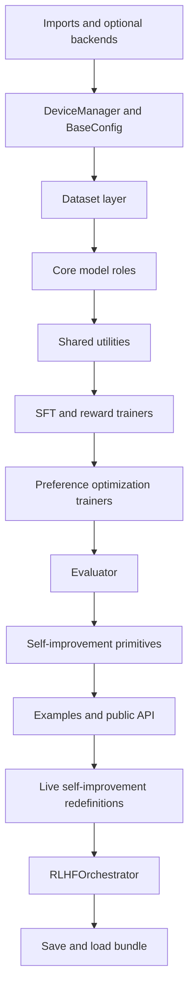
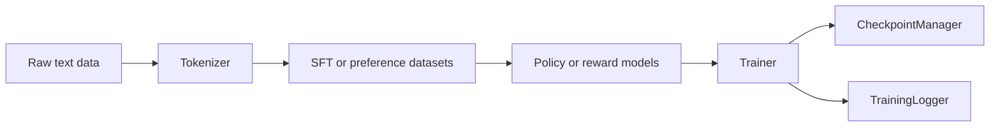
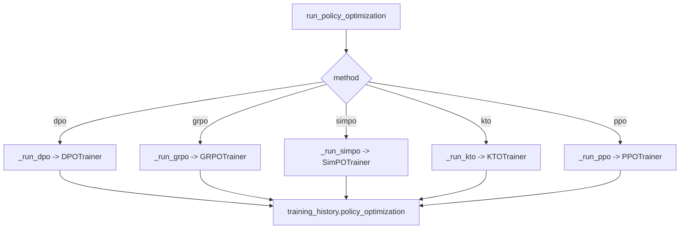
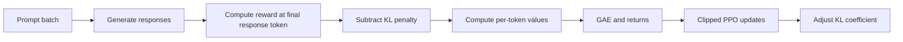
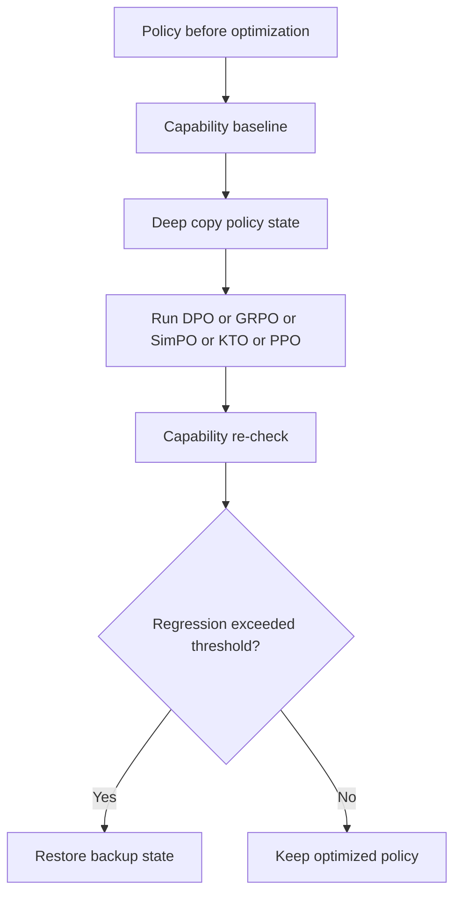
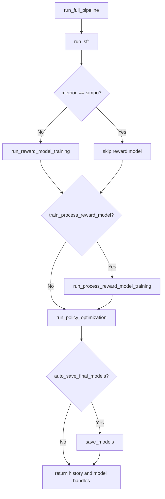
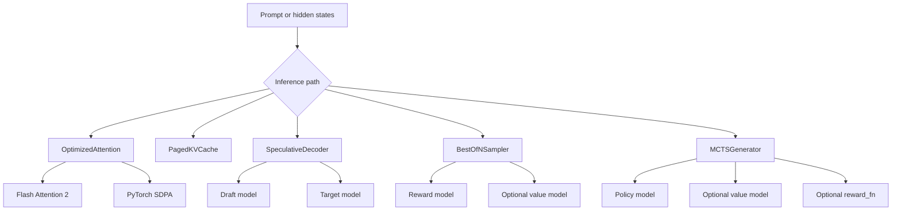
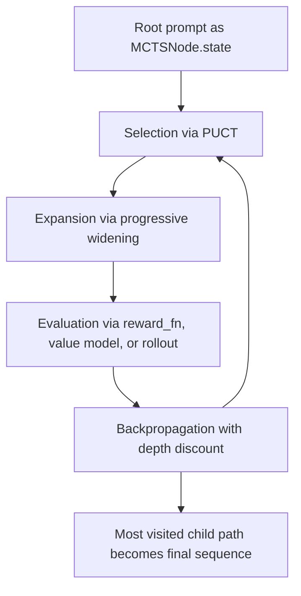
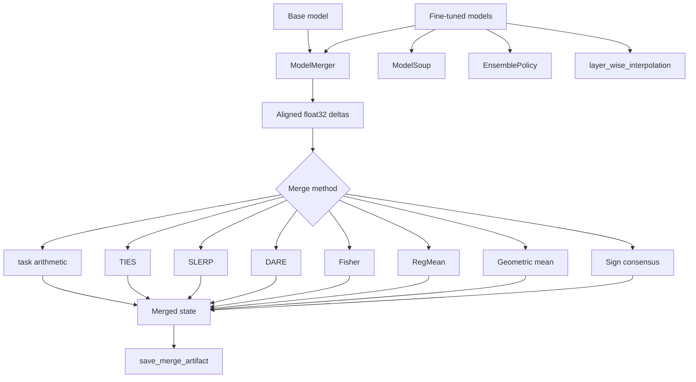
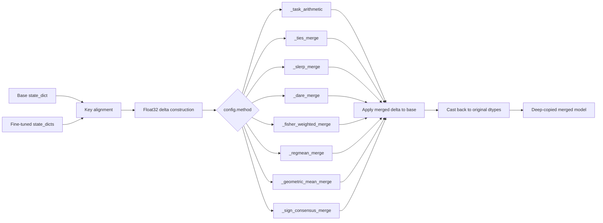

<div align="center">

# Full-RLHF-Pipeline: Internal `rlhf.py` Specification

### Implementation-Grounded Snapshot for March 8, 2026


[](https://www.gnu.org/licenses/gpl-3.0)
[](https://doi.org/10.5281/zenodo.18607464)


<br/>

[**Snapshot**](#snapshot) | [**File Map**](#file-map) | [**Foundation Stages**](#foundation-stages) | [**Six Optimization Methods**](#the-six-optimization-methods-in-the-current-file) | [**Seventh System**](#the-seventh-system-self-improvement-and-self-play-primitives) | [**Context Compression**](#context-compression) | [**Inference Optimizations**](#companion-module-inference_optimizationspy) | [**Model Merging**](#companion-module-model_mergingpy) | [**Orchestration**](#orchestration-and-persistence) | [**Caveats**](#current-implementation-caveats)

</div>

---

## Snapshot

This document describes what `rlhf.py` actually implements today, not what adjacent docs describe aspirationally. The source of truth for every section below is the current file on disk as inspected on **March 8, 2026**.

**Current file facts**

| Item | Value |
| --- | --- |
| Primary source | `rlhf.py` |
| Total lines | 7,564 |
| Top-level classes | 48 |
| Top-level functions | 107 |
| Dominant role | Single-file RLHF runtime with infrastructure, data, trainers, evaluator, self-improvement utilities, examples, and orchestration |

**Executive read**

`rlhf.py` is a monolithic but internally segmented RLHF runtime. It contains:

| Layer | What is implemented now |
| --- | --- |
| Runtime infrastructure | logging, device/precision handling, LoRA hook, checkpointing, optimizer creation |
| Data contracts | paired preference, SFT, KTO, GRPO prompt-only, plus streaming variants |
| Trainable model roles | policy, reward, process reward, value, context compressor |
| Training stages | SFT, reward model, process reward model, DPO, GRPO, SimPO, KTO, PPO |
| Evaluation | KL, reward accuracy, diversity, win-rate |
| Self-improvement | validator, capability regression checks, iterative refinement, rollback loop |
| Reward composition | reward function factory plus constitutional wrapper |
| Orchestration | end-to-end pipeline runner, model save/load, method dispatch |

Two things are especially important for an honest reading of the file:

1. The "six methods" are not all implemented as peer trainer classes. IPO is present as a **DPO loss mode**, not as a standalone `IPOTrainer`.
2. The "seventh" self-play layer is present as **self-improvement primitives and rollback logic**, not as a single `run_self_play()` or league-training engine inside `rlhf.py`.

---

## File Map

### Top-level banding

| File band | Lines | Current contents |
| --- | ---: | --- |
| Header and imports | 1-125 | module docstring, optional dependency gates, logger bootstrap |
| Runtime infrastructure | 126-205 | `DeviceManager`, `TrainingStage` |
| Config system | 209-412 | `BaseConfig`, `SFTConfig`, `RewardModelConfig`, `DPOConfig`, `GRPOConfig`, `SimPOConfig`, `KTOConfig`, `PPOConfig` |
| Dataset layer | 418-943 | in-memory and streaming datasets for SFT, preference pairs, KTO, GRPO |
| Trainable model layer | 950-1699 | `RewardModel`, `ProcessRewardModel`, `ValueModel`, `ContextCompressor`, `PolicyModel` |
| Shared utilities | 1705-1994 | LoRA hook, early stopping, logging, checkpoints, optimizer factory |
| Trainers | 2000-3686 | SFT, RM, PRM, DPO, GRPO, SimPO, KTO, PPO |
| Evaluation and config helpers | 3692-4194 | `RLHFEvaluator`, hardware presets |
| First self-improvement block | 4201-5405 | validator, capability tester, EWC, iterative refiner, reward wrappers |
| Example surfaces | 5412-5801 | orchestrator, trainer, reward, validation, evaluation, quickstart examples |
| Public API and CLI text | 6000-6187 | `__all__`, legacy command-line wrapper text |
| Reference and troubleshooting notes | 6194-6369 | embedded long-form notes and heuristics |
| Live self-improvement block | 6375-6658 | later `AdversarialValidator` and `CapabilityTester` redefinitions |
| Main orchestrator | 6665-7558 | `RLHFOrchestrator`, compression helpers, stage runners, save/load |

### Component graph



### Runtime truth about duplicate definitions

The file defines `AdversarialValidator` and `CapabilityTester` twice:

| Name | First definition | Later definition | Runtime effect |
| --- | ---: | ---: | --- |
| `AdversarialValidator` | 4228-4383 | 6375-6526 | later definition shadows the earlier class at import time |
| `CapabilityTester` | 4386-4529 | 6529-6658 | later definition shadows the earlier class at import time |

That means the orchestrator and any normal imports resolve to the **later** versions.

---

## Foundation Stages

The file does not begin with preference optimization. It begins with the scaffolding needed to make optimization stages consistent.

### Runtime infrastructure

| Component | Lines | Current behavior |
| --- | ---: | --- |
| `setup_logging` | 99-118 | Rich-backed logging when available, plain stream logging otherwise |
| `DeviceManager` | 126-191 | resolves `cuda -> mps -> cpu`, selects BF16 on Ampere+ GPUs, wraps autocast, scaler-aware backward/step, centralizes clipping |
| `apply_lora` | 1705-1740 | optional PEFT integration with default target modules `q_proj`, `v_proj`, `k_proj`, `o_proj` |
| `TrainingLogger` | 1816-1869 | console + optional WandB + optional TensorBoard |
| `CheckpointManager` | 1871-1951 | per-stage rolling checkpoint directories storing `model.pt`, `optimizer.pt`, and `metadata.json` |
| `create_optimizer` | 1953-1994 | AdamW with no-decay split for bias and layernorm plus cosine warmup schedule |

### Configuration system

Every major stage inherits from `BaseConfig`, so the file keeps one shared operational vocabulary for:

- learning rate, batch size, epochs, warmup, gradient accumulation
- AMP flags and dtype selection
- checkpoint cadence and resume path
- WandB and TensorBoard toggles
- LoRA knobs
- optional early stopping thresholds

Method-specific config classes then add only their own objective-specific fields.

```python
config = DPOConfig(
    output_dir="./checkpoints/dpo",
    beta=0.1,
    loss_type="sigmoid",
    batch_size=32,
    num_epochs=2,
)
```

### Dataset contracts

| Dataset | Lines | Contract |
| --- | ---: | --- |
| `PreferenceDataset` | 418-478 | paired `{prompt, chosen, rejected}` with separate chosen/rejected tokenization and `prompt_length` |
| `SFTDataset` | 480-540 | `{prompt, response}` with prompt masking in labels |
| `KTODataset` | 542-590 | `{prompt, response, label}` where `label in {0,1}` |
| `GRPODataset` | 592-623 | prompt-only records for online rollout generation |
| Streaming variants | 629-943 | file-backed iterable equivalents for preference, SFT, KTO, and prompt-only data |

### Core model roles

| Model | Lines | Current role |
| --- | ---: | --- |
| `RewardModel` | 950-1053 | pooled transformer encoder plus two-layer scalar reward head |
| `ProcessRewardModel` | 1055-1271 | outcome reward plus optional step-level reward extraction with newline/marker/learned boundary modes |
| `ValueModel` | 1273-1372 | PPO critic with optional shared backbone path |
| `ContextCompressor` | 1374-1586 | learned query-based attention compressor over hidden states |
| `PolicyModel` | 1588-1699 | causal LM wrapper with `forward`, `generate`, and per-token log-prob utilities |

### Foundation stage flow



---

## Pre-Optimization Stages

Before the six optimization methods, `rlhf.py` implements two prerequisite stages and one optional extension stage.

### 1. Supervised Fine-Tuning

**Implementation:** `SFTTrainer` at **2000-2129**, usually entered through `RLHFOrchestrator.run_sft()` at **6830-6891**.

**What it does now**

- trains the policy with masked labels so prompt tokens can be excluded from loss
- supports gradient accumulation, mixed precision, checkpointing, and evaluation hooks
- always writes a final checkpoint even when `save_steps` is larger than the whole run

### 2. Reward Model Training

**Implementation:** `RewardModelTrainer` at **2131-2286**, usually entered through `run_reward_model_training()` at **6893-6952**.

**What it does now**

- supports reward-model ensembles
- uses Bradley-Terry pairwise ranking over chosen vs rejected completions
- applies optional label smoothing, margin, and L2 regularization
- exposes ensemble mean and standard deviation through `predict()`

### 2B. Process Reward Model Training

**Implementation:** `ProcessRewardModelTrainer` at **2289-2445**, entered through `run_process_reward_model_training()` at **6954-7012**.

**What it does now**

- trains a process-aware reward model on the same paired preference data shape
- combines outcome reward with optional mean process reward via `process_reward_weight`
- creates a PRM surface that can later drive GRPO or PPO through `RewardFunctionFactory.from_process_reward_model()`

---

## The Six Optimization Methods In The Current File

For current `rlhf.py`, the cleanest implementation-grounded counting is:

1. DPO
2. IPO mode inside DPO
3. GRPO
4. SimPO
5. KTO
6. PPO

SFT and reward modeling are foundation stages, while IPO is implemented as a **loss branch inside `DPOTrainer`**, not as a separate trainer class.

### Method matrix

| Method | Live implementation surface | Reference model | Reward model needed during optimization | Training data shape | Notes |
| --- | --- | --- | --- | --- | --- |
| DPO | `DPOTrainer` + `DPOConfig(loss_type="sigmoid")` | Yes | No | paired preferences | classic log-ratio objective |
| IPO | `DPOTrainer` + `DPOConfig(loss_type="ipo")` | Yes | No | paired preferences | no standalone `IPOTrainer` |
| GRPO | `GRPOTrainer` | Yes | Yes or rule-based reward | prompt-only rollouts | group-relative normalized rewards |
| SimPO | `SimPOTrainer` | No | No | paired preferences | reference-free, length-normalized implicit reward |
| KTO | `KTOTrainer` | Yes | No | unpaired binary labels | EMA-based KL reference warmup |
| PPO | `PPOTrainer` | Yes | Yes or rule-based reward | prompt-only rollouts | value model + GAE + rollout buffer |

### Dispatch graph



### DPO

**Primary code:** `DPOTrainer` at **2447-2610**

**Operational behavior**

- freezes the reference model when `reference_model_freeze=True`
- computes response-only log-prob sums using `prompt_length`
- supports three loss branches: `sigmoid`, `hinge`, and `ipo`
- writes final checkpoints for short runs that do not naturally hit `save_steps`

**Actual loss branching**

```python
if self.config.loss_type == "sigmoid":
    losses = -F.logsigmoid(logits)
elif self.config.loss_type == "hinge":
    losses = torch.relu(1 - logits)
elif self.config.loss_type == "ipo":
    losses = (logits - 1 / (2 * self.config.beta)).pow(2)
```

### IPO

**Primary code:** not a trainer class of its own. IPO lives inside `DPOTrainer.compute_dpo_loss()` at **2529-2531**.

**What that means in practice**

- the file advertises IPO in the module header and README method roster
- current runtime exposure is `DPOConfig(loss_type="ipo")`
- IPO shares the DPO data path, reference-model path, logging path, and checkpoint path

**Usage surface**

```python
config = DPOConfig(
    output_dir="./checkpoints/ipo",
    loss_type="ipo",
    beta=0.1,
)
trainer = DPOTrainer(policy_model, reference_model, config, device_manager)
```

### GRPO

**Primary code:** `GRPOTrainer` at **2617-2941**

**Operational behavior**

- expands each prompt into `group_size` sampled completions
- scores completions with a provided `reward_fn(prompt, completion)`
- normalizes rewards within each group using `(r - mean) / std`
- applies PPO-style ratio clipping with a DeepSeek-style KL estimator
- can perform multiple policy updates per generated batch

**Important current detail**

GRPO includes a reward batching helper, but its fast path is written around tokenizer-backed reward objects discovered through object attributes. The sequential fallback remains the safe path and should be assumed unless the reward wrapper is validated against that interface.

### SimPO

**Primary code:** `SimPOTrainer` at **2948-3073**

**Operational behavior**

- uses no reference model
- treats length-normalized response log-probability as the implicit reward
- optimizes a margin-controlled sigmoid loss with `beta` and `gamma`
- reuses the standard paired preference dataset path

### KTO

**Primary code:** `KTOTrainer` at **3080-3250**

**Operational behavior**

- consumes unpaired binary preference labels
- computes response-only policy and reference log-prob sums
- maintains an EMA KL reference with a 10-step warmup buffer
- applies separate desirable and undesirable penalties via `lambda_u` and `lambda_d`

**Why this matters for the current file**

KTO is not just "binary DPO." The implementation explicitly stabilizes the KL baseline over early batches before switching to decay-based EMA updates.

### PPO

**Primary code:** `PPOTrainer` at **3252-3686**

**Operational behavior**

- owns a nested `Experience` dataclass for rollout storage
- samples responses from the policy online
- computes sparse terminal rewards using `reward_fn(prompt, response)`
- subtracts KL penalty against the frozen reference policy
- optionally whitens rewards across response tokens
- computes vectorized GAE
- uses separate policy and value optimizers
- adapts the KL coefficient toward an optional target

**Current PPO loop**



**Important implementation note**

PPO is the only method in the file that instantiates a `ValueModel` automatically inside the orchestrator when one does not already exist.

---

## The Seventh System: Self-Improvement And Self-Play Primitives

The repository rhetoric describes self-play as the seventh major method family. In `rlhf.py` today, that surface is best described as **self-improvement primitives plus rollback-aware orchestration**, not a dedicated self-play trainer.

### What exists now

| Component | Lines | Current role |
| --- | ---: | --- |
| `AdversarialValidator` | live definition at 6375-6526 | scores generated representations and code snippets for flaws, coherence, and quality dimensions |
| `CapabilityTester` | live definition at 6529-6658 | runs synthetic capability probes before and after optimization |
| `IterativeRefiner` | 4734-5019 | generate -> validate -> refine loop |
| `run_policy_optimization()` rollback logic | 7014-7165 | pre-score, train, post-score, rollback on regression |
| `ConstitutionalRewardWrapper` | 5151-5405 | multi-objective reward shaping over helpfulness, harmlessness, honesty |

### What does not exist in `rlhf.py`

- no `SelfPlayTrainer`
- no `run_self_play()`
- no league training manager
- no explicit current-vs-previous-policy tournament loop

That means the "seventh" layer is real, but it is currently composed from:

1. **validator-based critique**
2. **capability regression tests**
3. **iterative refinement**
4. **orchestrator rollback**
5. **reward shaping utilities**

### Self-improvement loop in the orchestrator



### Iterative refinement as implemented

`IterativeRefiner` does not run a tournament. It:

1. generates an initial answer if one is not provided
2. embeds the current output
3. sends that embedding through `AdversarialValidator`
4. records flaws and score
5. builds a refinement prompt from those flaws
6. regenerates
7. stops on quality threshold, no-flaw state, or `max_iterations`

**Current usage surface**

```python
validator = AdversarialValidator(input_dim=768, hidden_dim=256)
refiner = IterativeRefiner(policy_model, validator, tokenizer, max_iterations=3)
best_output, history = refiner.refine(
    prompt="Explain the transformer architecture.",
    return_history=True,
)
```

### Constitutional reward shaping

The constitutional layer is present as a reward wrapper, not a separate training stage. It currently scores:

- helpfulness
- harmlessness
- honesty

and then blends those principle scores **50/50** with the base reward.

### Implementation truth

The self-improvement subsystem is meaningful and usable, but the spec should not describe it as a fully wired self-play league or autonomous tournament engine. The code currently supports **self-critique, regression gating, rollback, and reward shaping**.

---

## Context Compression

### What is implemented today

The context compression surface is real and code-backed.

| Surface | Lines | Current behavior |
| --- | ---: | --- |
| `ContextCompressor` | 1374-1586 | learned query tokens attend over full hidden states, then project into compressed states |
| `_ensure_context_compressor()` | 6768-6784 | lazy initialization once a policy model exists |
| `compress_context_from_ids()` | 6786-6809 | gets final hidden states from the policy backbone and compresses them |
| `compress_prompts()` | 6811-6828 | tokenizes prompt strings then routes through compression |
| save/load hooks | 7489-7550 | bundle compressor into final model artifacts when present |

### How the compressor works in code


### Implementation details that matter

- compression length is `max(1, seq_len // compression_ratio)`
- the compressor is built from:
  - learned query parameters
  - `nn.MultiheadAttention`
  - a two-layer GELU projection MLP
  - layer norm
- `expand()` uses linear interpolation back to the target sequence length
- `compute_reconstruction_loss()` uses masked MSE over original hidden states

### Current integration boundary

The compressor is integrated into the orchestrator as a **utility and persistence surface**. It is **not yet threaded through the trainer loss paths or policy generation API** as an always-on long-context mode.

That distinction matters:

- `run_sft()` can initialize it if `use_context_compressor=True`
- `save_models()` and `load_models()` preserve it
- callers can use `compress_prompts()` manually
- core trainers do not currently consume compressed states directly

**Current usage surface**

```python
orchestrator = RLHFOrchestrator(
    base_model="meta-llama/Llama-2-7b-hf",
    output_dir="./rlhf_output",
    use_context_compressor=True,
    context_compression_ratio=4,
    context_compression_heads=8,
)

orchestrator.run_sft(sft_data)
compressed_states, compressed_mask = orchestrator.compress_prompts(
    prompts=["Long prompt A", "Long prompt B"],
    max_length=2048,
)
```

---

## Other Major Systems In `rlhf.py`

### Evaluation

`RLHFEvaluator` at **3692-3945** provides four evaluation families:

| API | What it measures |
| --- | --- |
| `compute_kl_divergence()` | forward, reverse, and symmetric KL against a reference policy |
| `generate_responses()` | sampled outputs plus simple metadata |
| `compute_reward_accuracy()` | chosen-vs-rejected reward accuracy and margins |
| `compute_diversity_metrics()` / `compute_win_rate()` | diversity and reward-model judged win-rate |

### Reward construction

`RewardFunctionFactory` at **5026-5148** is the adapter layer that lets GRPO and PPO consume:

- trained reward models
- trained process reward models
- simple rule-based rewards
- weighted combinations of reward functions

This is a major design choice in the file. Trainers do not require a single hardcoded reward implementation. They consume a common callable signature:

```python
reward_fn(prompt: str, completion: str) -> float
```

### Examples and operator-facing entry points

The file itself already contains copyable examples:

| Example function | Lines | Best use |
| --- | ---: | --- |
| `example_orchestrator_usage()` | 5412-5464 | end-to-end pipeline |
| `example_individual_trainers()` | 5467-5607 | stage-by-stage control |
| `example_custom_reward_function()` | 5610-5681 | custom GRPO/PPO rewards |
| `example_self_improvement_validation()` | 5684-5732 | validator and capability tester |
| `example_evaluation()` | 5735-5776 | evaluator flow |
| `example_minimal_quickstart()` | 5779-5801 | minimal orchestration surface |

### Public API

`__all__` at **6000-6066** exports the trainer classes, core models, configs, datasets, utilities, evaluator, reward factory, self-improvement helpers, and examples.

---

## Orchestration And Persistence

### `RLHFOrchestrator`

The orchestrator at **6665-7558** is the file's control plane.

### What it owns

| Concern | Current behavior |
| --- | --- |
| Tokenizer | initialized in constructor and given a pad token if missing |
| Policy lifecycle | created during SFT, backed up before policy optimization, rolled back on failure/regression |
| Reference policy | lazy-created frozen copy from the SFT policy |
| Reward models | ensemble list managed by the reward-model stage |
| Process reward model | optional second-stage extension |
| Value model | lazy-created for PPO |
| Context compressor | lazy-created and persisted when enabled |
| Training history | stores `sft`, `reward_model`, `process_reward_model`, `policy_optimization`, and `rollbacks` |

### End-to-end stage sequence



### Save and load contract

The model bundle written by `save_models()` can contain:

- `policy_model/`
- `reward_model_0/`, `reward_model_1/`, ...
- `process_reward_model/`
- `value_model/`
- `context_compressor/`
- `tokenizer/`
- `training_history.json`

This makes `RLHFOrchestrator` both a trainer dispatcher and the persistence boundary for the full pipeline.

---

## Companion Module: `inference_optimizations.py`

### Why it belongs in this internal spec

The core training runtime still lives in `rlhf.py`, but the adjacent `inference_optimizations.py` file is the concrete implementation site for the repo's inference-time acceleration and search stack. It should be treated as a companion module, not as an aspirational appendix. The code on disk as of **March 8, 2026** provides real implementations for speculative decoding, best-of-N reranking, MCTS-based generation, paged KV cache management, and Flash Attention 2 / SDPA attention fallback.

### Snapshot

| Item | Value |
| --- | --- |
| Primary source | `inference_optimizations.py` |
| Total lines | 1,359 |
| Top-level classes | 9 |
| Top-level functions | 44 |
| Dominant role | Standalone inference-time compute, decoding, reranking, and search utilities |
| Main entry points | `OptimizedAttention`, `PagedKVCache`, `SpeculativeDecoder`, `BestOfNSampler`, `MCTSGenerator`, `compile_model` |

### File-local banding

| Band | Primary contents |
| --- | --- |
| 1-59 | Module docstring, imports, output-adapter helpers |
| 95-183 | `OptimizedAttention` |
| 185-376 | `PagedKVCache` |
| 378-623 | `SpeculativeDecoderConfig`, `SpeculativeDecoder` |
| 625-905 | `BestOfNConfig`, `BestOfNSampler` |
| 907-1300 | `MCTSConfig`, `MCTSNode`, `MCTSGenerator` |
| 1301-1359 | `compile_model()` and module-level usage examples |

### System graph



### Output adapters and compatibility layer

The first meaningful design decision in the file is that the optimization code does not assume a single Hugging Face output type. `_extract_logits()` accepts raw tensors, dictionaries with `logits` or `scores`, and object-like outputs exposing `logits` or `scores` attributes. `_extract_past_key_values()` does the same for cache-aware generation. `_extract_scalar_output()` is even more permissive: it reduces tensors directly, looks for `score`, `reward`, `rewards`, `value`, `values`, or `logits` in dict or object outputs, and returns `0.0` if no recognizable scalar-like signal exists.

That helper layer matters because both `BestOfNSampler` and `MCTSGenerator` use duck-typed reward and value models. In practice, this module is written to sit on top of heterogeneous policy, reward, and value wrappers rather than a single canonical model API.

### `OptimizedAttention`

`OptimizedAttention` is a self-contained multi-head attention block with its own `q_proj`, `k_proj`, `v_proj`, and `o_proj` layers. The runtime dispatch is simple and concrete:

| Path | Conditions | Behavior |
| --- | --- |
| Flash Attention 2 | `flash_attn` import succeeds, `hidden_states.is_cuda` is true, and `is_causal=True` | calls `flash_attn_func(q, k, v, ...)` directly |
| SDPA fallback | any non-CUDA path, any non-causal path, or any Flash exception | transposes to `(batch, heads, seq, dim)` and calls `torch.nn.functional.scaled_dot_product_attention()` |

This means the file really does provide an automatic "fast path then native fallback" attention block. It does not, however, try to be a drop-in replacement for every masked attention case. The `attention_mask` is only passed through the SDPA path. The Flash path ignores it entirely because the `flash_attn_func()` call only forwards `q`, `k`, `v`, `dropout_p`, `causal`, and `softmax_scale`.

### `PagedKVCache`

`PagedKVCache` exposes the right kinds of interfaces for paged-attention-style caching: `allocate()`, `append_token()`, `get_kv()`, `free()`, `fragmentation_ratio`, `evict_lru()`, `register_prefix()`, and `stats()`. The telemetry is also real: cache hits and evictions are counted, sequence last-access timestamps are updated, and a fragmentation estimate is computed from used tokens versus allocated page capacity.

The storage layout is:

```python
self.cache.shape == (max_pages, 2, page_size, num_heads, head_dim)
```

So each page stores key and value tensors for a fixed number of token slots. Sequence metadata is tracked through:

- `sequence_pages`
- `sequence_lengths`
- `sequence_last_access`
- `shared_prefix_keys`

The important implementation truth is that this interface is more mature than the underlying storage model. `num_layers` is accepted and stored, and both `append_token()` and `get_kv()` accept `layer_idx`, but the actual cache tensor has no layer dimension and neither method indexes by layer. As written today, the class behaves like a single-layer KV store with a multi-layer-looking API.

The same distinction appears in prefix sharing. `register_prefix()` records a copy-on-write marker under `shared_prefix_keys`, but `free()` still returns the sequence's pages to `free_pages` immediately. The docstring promises shared-prefix preservation semantics that the current implementation does not yet enforce.

### `SpeculativeDecoder`

`SpeculativeDecoder` is the most algorithmically explicit component in the file. Its docstring names the Chen et al. 2023 acceptance-resampling rule directly, and the code matches that description:

```mermaid
flowchart LR
    A[Current prefix] --> B[Draft model proposes gamma tokens plus probs]
    B --> C[Target model runs once on prefix plus draft tokens]
    C --> D{Accept token by min(1, p_target / p_draft)?}
    D -->|Yes| E[Append drafted token]
    D -->|No| F[Resample from positive part of p_target - p_draft]
    E --> G{All gamma accepted?}
    G -->|Yes| H[Append one bonus token from target]
    G -->|No| I[Next outer loop]
    F --> I
    H --> I
```

At runtime, the decoder:

1. Uses `_draft_generate_with_probs()` to sample up to `gamma` draft tokens and retain their probability distributions.
2. Concatenates the current prefix and draft tokens, then runs the target model once across that combined sequence.
3. Computes acceptance probabilities token by token using `p_target / p_draft`, clamped at `1.0`.
4. If a token is rejected, resamples from the positive part of `(p_target - p_draft)` and immediately ends that speculative segment.
5. If the whole draft segment is accepted, appends one extra "bonus" token from the target distribution.

The adaptive control loop is real too. `SpeculativeDecoderConfig` exposes `adapt_gamma`, `gamma_min`, `gamma_max`, and `adapt_window`. The decoder keeps `_accepted_history`, updates `_current_gamma`, and increases or decreases the speculative window based on recent acceptance rates.

The fast path depends on `past_key_values`. `_draft_generate_with_probs()` and `_draft_generate()` both try cached incremental generation first and fall back to a stateless autoregressive loop on exception. Telemetry is exposed through `accepted_tokens`, `total_draft_tokens`, and the `acceptance_rate` property.

### `BestOfNSampler`

`BestOfNSampler` is a practical reranking engine rather than a toy wrapper. Its control flow is:

1. Generate `n_samples` candidate continuations with `policy.generate(...)`.
2. Score those candidates with the reward model, optionally via `reward.score_batch(...)`.
3. Optionally blend in a value-model signal.
4. Apply length and repetition penalties.
5. Hard-filter candidates with `format_checker` by forcing invalid ones to `-inf`.
6. Optionally add a diversity bonus based on pairwise edit distance.
7. Return the best candidate plus aggregate stats and, if requested, all candidates and scores.

The scoring surface is configurable through `BestOfNConfig`, which includes:

- `reward_aggregation`
- `use_diversity_bonus`
- `diversity_weight`
- `value_weight`
- `length_penalty`
- `repetition_penalty`
- `format_checker`
- `batch_score`

The reward and value hooks are deliberately permissive. `_score_one()` and `_score_value()` accept `.score(text)`, `.score_text(text)`, or a raw `nn.Module` forward path with tokenizer fallback. If the reward model exposes neither a direct scoring method nor a tokenizer-backed forward path, the sampler emits a warning once and all candidates score `0.0`.

Diversity is lexical rather than semantic. `_compute_diversity()` measures average pairwise edit distance across candidates, using RapidFuzz when available and a pure Python Levenshtein implementation otherwise. That is a reasonable implementation for structural diversity, but it should not be mistaken for embedding-space novelty or task-space coverage.

### `MCTSGenerator`

`MCTSGenerator` is a genuine tree-search generator built around `MCTSNode` and `MCTSConfig`. It is not just "sample several branches and pick one later." The class implements the usual four-phase loop directly:



The concrete runtime behavior is:

- `generate()` creates a root node from the prompt string and runs `n_simulations`.
- `_select()` repeatedly chooses `best_child()` using `ucb_score()` / PUCT-style exploration.
- `_expand()` uses progressive widening with `ceil((visits + 1) ** progressive_widening_alpha)`.
- `_generate_actions()` tokenizes the current string state, reads the last-token policy logits, and decodes top-k next-token candidates one token at a time.
- `_evaluate()` blends reward and value according to `reward_value_blend` when both are available.
- `_rollout()` first tries incremental cached generation with `past_key_values`, then falls back to repeated single-action expansion if caching is unavailable.
- `_backpropagate()` discounts value by ancestor depth using `depth_discount`.

The return value is richer than a single string. `generate()` yields:

- `text`
- `root`
- `visit_counts`
- `best_child_values`
- optionally `tree_json` when `serialize_tree=True`

There are also several very specific implementation boundaries that matter when reading or extending this class. Node state is stored as decoded text, not token IDs. `_is_terminal()` checks string length (`len(state) > 2000`) and string suffix against `tokenizer.eos_token`, while `_rollout()` computes `max_new_tokens` from tokenized input length. So the class mixes token-space and string-space stopping rules in the current implementation.

### `compile_model()` and module examples

`compile_model()` is intentionally thin. It checks whether `torch.compile` exists, attempts compilation with `fullgraph=False`, prints a success or failure message, and returns the original model unchanged if compilation is unavailable or raises an exception. This is a convenience wrapper, not a larger compile-and-benchmark subsystem.

The module-level `if __name__ == "__main__":` block is also worth documenting because it signals the intended operator-facing surface. It prints a banner of available optimizations and includes short inline examples for Best-of-N sampling, MCTS reasoning, and `compile_model()`. In other words, the file is written as a runnable utility module, not just a bag of classes.

### Example usage patterns in the current module style

```python
from inference_optimizations import (
    BestOfNConfig,
    BestOfNSampler,
    MCTSConfig,
    MCTSGenerator,
    SpeculativeDecoder,
    SpeculativeDecoderConfig,
    compile_model,
)

spec = SpeculativeDecoder(
    target_model=target_model,
    draft_model=draft_model,
    config=SpeculativeDecoderConfig(gamma=4, adapt_gamma=True),
)
fast_ids = spec.generate(input_ids, max_new_tokens=128)

sampler = BestOfNSampler(
    policy_model=policy_model,
    reward_model=reward_model,
    tokenizer=tokenizer,
    config=BestOfNConfig(n_samples=8, use_diversity_bonus=True),
)
ranked = sampler.generate("Solve carefully:", tokenizer, return_all=True)

mcts = MCTSGenerator(
    policy_model=policy_model,
    value_model=value_model,
    tokenizer=tokenizer,
    config=MCTSConfig(n_simulations=64, serialize_tree=True),
)
tree_result = mcts.generate(
    prompt="Solve: 2x + 5 = 13",
    reward_fn=check_answer,
)

compiled_policy = compile_model(policy_model, mode="max-autotune")
```

### Wiring reality in the repo

This companion module is real code, but it is not currently the same kind of runtime center that `rlhf.py` is. A repo-wide search shows the main references in `benchmark_harness.py`, `inference_protocols.py`, and documentation files. It is not wired into `RLHFOrchestrator` inside `rlhf.py`. So the correct mental model is:

- `rlhf.py` owns the end-to-end training and persistence pipeline.
- `inference_optimizations.py` owns a standalone inference toolkit that can be instantiated by benchmark or protocol layers.

### Companion-module caveats that should be treated as implementation facts

| Topic | Current reality in `inference_optimizations.py` |
| --- | --- |
| KV cache layer awareness | `num_layers` is stored, but the cache tensor has no layer axis and `layer_idx` is unused in the actual storage path |
| Prefix sharing | `register_prefix()` records a marker, but `free()` still returns pages immediately rather than enforcing last-reference copy-on-write semantics |
| Flash attention masking | `attention_mask` is only forwarded through the SDPA path, not the Flash Attention 2 call |
| MCTS stopping rules | token-count logic in rollout is mixed with string-length and string-suffix terminal checks |
| Orchestrator integration | the module is used by inference-side code, not integrated into `RLHFOrchestrator` |

---

## Companion Module: `model_merging.py`

### Why it belongs in this internal spec

`model_merging.py` is the repo's post-training merge and ensembling toolkit. It sits beside `rlhf.py` rather than inside it, but it is still part of the real runtime surface described by this project. As of **March 8, 2026**, the file provides concrete delta-based merge algorithms, conflict analytics, deterministic state-dict hashing, merge artifact saving, model soups, a small ensemble generation wrapper, and layer-wise interpolation helpers.

### Snapshot

| Item | Value |
| --- | --- |
| Primary source | `model_merging.py` |
| Total lines | 866 |
| Top-level classes | 4 |
| Top-level functions | 24 |
| Dominant role | Standalone post-training merge, provenance, soup, and ensemble utility module |
| Main entry points | `MergeConfig`, `ModelMerger`, `save_merge_artifact`, `ModelSoup`, `EnsemblePolicy`, `layer_wise_interpolation` |

### File-local banding

| Band | Primary contents |
| --- | --- |
| 1-43 | Module docstring, imports, version tag, logger |
| 45-67 | `MergeConfig` |
| 70-550 | `ModelMerger` validation, key alignment, merge algorithms, conflict analytics |
| 553-663 | SHA256 helper, checkpoint utilities, artifact saving |
| 666-724 | `ModelSoup` |
| 726-797 | `EnsemblePolicy` |
| 799-832 | `layer_wise_interpolation()` |
| 834-866 | module-level usage examples |

### System graph



### `MergeConfig`

`MergeConfig` is the file's control surface. It exposes:

- `method`
- `weights`
- `density`
- `epsilon`
- `normalize`
- `seed`
- `layer_density_map`
- `confidence_threshold`
- `karcher_steps`
- `karcher_threshold`

The merge methods declared in the file are:

| Method key | Current implementation |
| --- | --- |
| `task_arithmetic` | weighted average of deltas |
| `ties` | trim-elect-sign-average |
| `slerp` | spherical interpolation between exactly two fine-tuned models |
| `dare` | random drop-and-rescale over deltas |
| `fisher` | Fisher-weighted delta blend |
| `regmean` | Gram-matrix-weighted blend |
| `geometric_mean` | iterative Karcher mean in delta space |
| `sign_consensus` | confidence-thresholded sign agreement |

One important implementation truth already shows up here: `normalize` is declared on the config surface, but the current file does not actually branch on or consume that flag anywhere in its merge logic.

### `ModelMerger`

`ModelMerger` is the main engine. The high-level contract is simple and solid:

1. validate method-specific preconditions
2. seed PyTorch for deterministic randomized merge paths
3. read `state_dict()` from the base and fine-tuned models
4. align parameter keys across all models
5. compute float32 deltas relative to the base model
6. run the selected merge algorithm
7. add the merged delta back onto the base weights
8. cast merged tensors back to the base parameter dtype
9. deep-copy the base model and load the merged state

That design choice matters. The file really does merge in float32 even when source checkpoints are BF16 or FP16, and the tests in `tests/test_model_merging.py` explicitly exercise that behavior.

### Merge dispatch and algorithm matrix

| Algorithm | Extra inputs | Current implementation behavior |
| --- | --- | --- |
| Task Arithmetic | optional `weights` | averages deltas and normalizes by total weight |
| TIES | `density`, optional `layer_density_map` | trims by magnitude, elects majority sign, averages agreeing deltas |
| SLERP | exactly 2 fine-tuned models, optional `weights[0]` as interpolation coefficient | interpolates between delta vectors in spherical space with linear fallback for degenerate norms |
| DARE | `density`, `seed`, optional `layer_density_map` | samples a random mask and rescales by kept density |
| Fisher | optional `fisher_weights` | uses diagonal Fisher weights when supplied, otherwise approximates them with `abs(delta) + epsilon` |
| RegMean | optional `gram_matrices` | uses per-parameter Gram weights when supplied, otherwise falls back to task arithmetic |
| Geometric Mean | `karcher_steps`, `karcher_threshold` | iteratively refines arithmetic mean toward a Karcher-style mean in delta space |
| Sign Consensus | `confidence_threshold` | keeps only parameters where enough models agree on sign |

### Merge flow in the current implementation



### Validation and alignment behavior

The pre-validation layer is modest but real:

- `slerp` rejects anything other than exactly two fine-tuned models
- `dare` and `ties` require `density` in `(0, 1]`
- `fisher` only warns when Fisher weights are absent, because the implementation has a magnitude-based fallback

Key alignment is intersection-based. `_align_keys()` compares the base state dict with every fine-tuned state dict, warns about missing and extra keys, drops anything not common to every model, and returns a sorted intersection. Non-floating-point parameters are never merged as deltas; they pass through from the base state unchanged.

### Conflict analytics and provenance helpers

The file contains a real post-merge analytics layer:

- `compute_conflict_report()` computes `delta_norm`, `cosine_conflict`, `sign_disagreement_ratio`, and `drift_ratio` per aligned key.
- `_sha256_state_dict()` computes a stable hash over sorted keys and tensor bytes.
- `list_stage_checkpoints()` and `load_checkpoint_state_dict()` bridge into `rlhf.py` checkpoint directories such as `DPO_step_20` and `SFT_step_40`.
- `save_merge_artifact()` writes `merged_model.pt` plus `merge_manifest.json` containing hashes, config snapshot, conflict report, key-alignment summary, code version, and caller metadata.

This is the most important provenance flow in the file:

```mermaid
flowchart TD
    A[Merged model] --> B[state_dict()]
    B --> C[_sha256_state_dict]
    D[Input state_dicts] --> E[input SHA256 list]
    C --> F[merge_manifest.json]
    E --> F
    G[MergeConfig snapshot] --> F
    H[Conflict report] --> F
    I[Key alignment summary] --> F
    J[Caller metadata] --> F
    B --> K[merged_model.pt]
```

### `ModelSoup`

`ModelSoup` is intentionally simpler than `ModelMerger`. `create_soup()` just averages full parameters across models using optional weights and then loads the result into a deep copy of the first model. `greedy_soup()` sorts candidate models by `eval_fn(model)`, adds them one at a time only if the soup improves the score, and returns the best greedy subset averaged through `create_soup()`.

The key distinction is that soups operate directly on full weights, not base-relative deltas. They also do not expose the alignment diagnostics or provenance hooks that `ModelMerger` does.

### `EnsemblePolicy`

`EnsemblePolicy` provides two generation modes:

| Method | Current behavior |
| --- | --- |
| `average` | runs each model on the current token prefix, averages weighted logits, samples the next token, and stops on the first model's `eos_token_id` |
| `voting` | asks each model to generate a full candidate sequence independently and returns the exact majority sequence by stringified tensor equality |

This is a usable wrapper, but it is deliberately lightweight. Unlike `inference_optimizations.py`, it does not include compatibility helpers for diverse output object shapes. The averaging path assumes `outputs.logits` exists, and the voting path is exact-sequence majority vote rather than token-level or reward-weighted arbitration.

### `layer_wise_interpolation()`

`layer_wise_interpolation()` is a direct parameter interpolation helper between two models. It groups parameters by a regex match on `layer.(\d+)`, selects a per-layer weight from `layer_weights`, defaults all non-matching keys to `0.5`, interpolates parameters directly as `(1 - weight) * p1 + weight * p2`, and returns a deep copy of `model1` loaded with the interpolated state.

This function is useful as a targeted utility, but it is not built on the same key-alignment or delta-based machinery as `ModelMerger`.

### Example usage patterns in the current module style

```python
from model_merging import (
    MergeConfig,
    ModelMerger,
    ModelSoup,
    EnsemblePolicy,
    layer_wise_interpolation,
    save_merge_artifact,
)

cfg = MergeConfig(
    method="ties",
    density=0.6,
    seed=42,
    layer_density_map={r"lm_head.*": 1.0},
)
merger = ModelMerger(cfg)
merged = merger.merge(base_model, [math_model, code_model, reasoning_model])

base_state = base_model.state_dict()
ft_states = [m.state_dict() for m in [math_model, code_model, reasoning_model]]
aligned = merger._align_keys(base_state, ft_states)
conflicts = merger.compute_conflict_report(base_state, ft_states, aligned)

artifact = save_merge_artifact(
    merged,
    "output/merged",
    merge_config=cfg,
    input_state_dicts=ft_states,
    conflict_report=conflicts,
    key_alignment_summary={"aligned_keys": len(aligned)},
)

soup = ModelSoup.greedy_soup(base_model, [math_model, code_model], eval_fn)
ensemble = EnsemblePolicy([math_model, code_model], weights=[0.7, 0.3], method="average")
hybrid = layer_wise_interpolation(math_model, code_model, layer_weights=[0.1, 0.2, 0.8, 1.0])
```

### Wiring reality in the repo

This companion module is used more concretely than the existing inference module in one important place: `benchmark_harness.py` imports `MergeConfig` and `ModelMerger` directly. The file also has an explicit targeted test suite in `tests/test_model_merging.py`, and that suite passed in this workspace on **March 8, 2026**:

```text
16 passed in 11.13s
```

At the same time, `model_merging.py` is still not part of the `RLHFOrchestrator` path in `rlhf.py`. The correct boundary is:

- `rlhf.py` trains and saves stage outputs
- `model_merging.py` consumes compatible state dicts after training
- `benchmark_harness.py` and release/packaging flows are where merge strategies are actually exercised in-repo

### Companion-module caveats that should be treated as implementation facts

| Topic | Current reality in `model_merging.py` |
| --- | --- |
| `normalize` flag | declared on `MergeConfig` but unused in the current merge code |
| Manifest determinism | `_sha256_state_dict()` is deterministic for state dicts, but `save_merge_artifact()` also writes `created_at_unix`, so the manifest is not byte-for-byte deterministic across runs |
| Checkpoint loading | `load_checkpoint_state_dict()` calls `torch.load(..., map_location=\"cpu\")` without `weights_only=True` |
| Soup API surface | `ModelSoup.create_soup()` accepts `interpolation_weights`, but the current implementation does not use that argument |
| Greedy soup signature | `ModelSoup.greedy_soup()` accepts `base_model`, but the current implementation never references it |
| Ensemble assumptions | `EnsemblePolicy` assumes HF-style `.logits` outputs in average mode and exact full-sequence equality in voting mode |
| Batch behavior | `EnsemblePolicy._average_generate()` uses `next_token.item()` for EOS stopping, which makes the implementation effectively batch-size-1 oriented |
| Layer regex | `layer_wise_interpolation()` only groups keys matching `layer.(\\d+)`; everything else defaults to weight `0.5` |
| Doc drift | `README.md` currently shows a `MergeConfig(..., scaling_coef=1.0)` example, but `MergeConfig` does not define `scaling_coef` |
| Orchestrator integration | merge utilities are adjacent to the RLHF pipeline, not integrated into `RLHFOrchestrator` |

---

## Current Implementation Caveats

This section is intentionally blunt because the goal is an internal spec that reflects the codebase accurately.

| Topic | Current reality in `rlhf.py` |
| --- | --- |
| IPO | implemented as `DPOConfig.loss_type="ipo"`, not a dedicated trainer class |
| Self-play | implemented as self-improvement pieces and rollback logic, not `run_self_play()` |
| Context compression | implemented and persisted, but not yet woven through trainer forward paths as an always-on training or generation mode |
| Duplicate classes | `AdversarialValidator` and `CapabilityTester` are each defined twice; later definitions are the live runtime ones |
| CLI text | embedded help text still references `self_rlhf.py` and `self_rlhf` import names |
| LoRA namespace collision | the module imports PEFT `TaskType`, then later defines a custom `TaskType` enum for capability testing; the LoRA path should therefore be revalidated carefully before being treated as production-safe |
| Capability regression testing | current orchestrator regression checks use synthetic tensor probes through a `SimpleModelWrapper`, not prompt-grounded benchmark tasks |

---

## Recommended Reading Order For The File

For anyone continuing work on `rlhf.py`, the most productive read order is:

1. `DeviceManager`, config classes, and datasets
2. `PolicyModel`, `RewardModel`, `ProcessRewardModel`, `ValueModel`, `ContextCompressor`
3. `SFTTrainer`, `RewardModelTrainer`, `ProcessRewardModelTrainer`
4. `DPOTrainer`, `GRPOTrainer`, `SimPOTrainer`, `KTOTrainer`, `PPOTrainer`
5. `RLHFEvaluator`
6. `IterativeRefiner`, `RewardFunctionFactory`, `ConstitutionalRewardWrapper`
7. the later `AdversarialValidator` and `CapabilityTester`
8. `RLHFOrchestrator`

That ordering matches how the file actually composes at runtime.

---

## Bottom Line

As of **March 8, 2026**, `rlhf.py` is a large but usable single-file RLHF runtime with:

- complete foundation stages for SFT and reward modeling
- five dedicated policy-optimization trainers plus IPO as a DPO loss branch
- a real evaluator and reward composition layer
- an honest self-improvement stack built from validation, regression gating, refinement, and rollback
- a real context-compression utility that is integrated at the orchestrator and persistence level
- a companion inference module with real Flash/SDPA attention dispatch, paged KV cache utilities, speculative decoding, best-of-N reranking, MCTS search, and a lightweight `torch.compile` wrapper
- a companion merge module with float32 delta-based merge methods, conflict analytics, SHA256 provenance helpers, soups, simple ensembles, and layer-wise interpolation
- an end-to-end orchestrator that can train, checkpoint, save, and reload the full bundle

The key to documenting it correctly is to separate **fully wired training paths** from **utility-level or primitive-level features**. This version of the spec does that explicitly.
